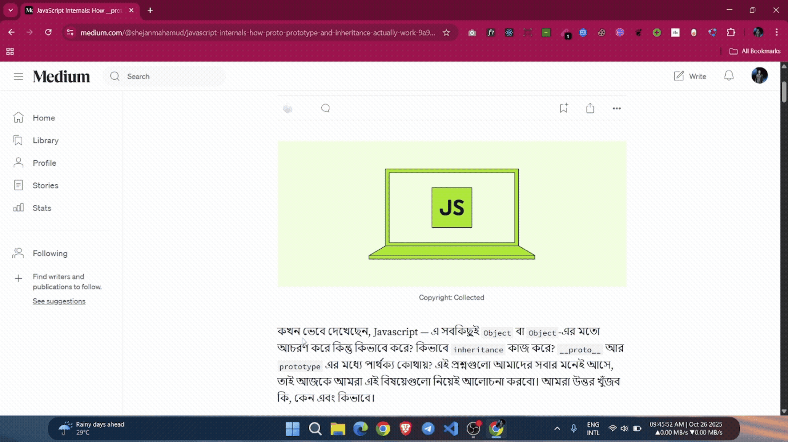

# Picky Share - Chrome Extension

**Picky Share** is a Chrome extension that allows you to select text from any webpage and instantly create a shareable public URL using the [paste.rs](https://paste.rs/) service.

## Demo



## Features

- **Easy Text Sharing**: Select any text on a webpage to create a shareable link
- **One-Click Copy**: Copy the generated link to clipboard instantly
- **Inline Share Button**: Share interface appears directly when you select text
- **Public URLs**: Generate permanent shareable links
- **Share History**: View and reuse your recent shares
- **Clean UI**: Intuitive popup and content UI with visual feedback
- **Privacy-First**: No data stored locally; uses paste.rs service
- **Error Handling**: Comprehensive error messages and retry logic
- **Logging**: Built-in logging for debugging

## Quick Start

### Installation for Development

1. Clone the repository:

```bash
git clone https://github.com/ShejanMahamud/picky-share
cd picky-share
```

2. Install dependencies:

```bash
pnpm install
```

3. Start development server:

```bash
pnpm run dev
```

4. Load the extension in Chrome:

   - Open Chrome and navigate to `chrome://extensions/`
   - Enable **"Developer mode"** (toggle in top right)
   - Click **"Load unpacked"**
   - Select the `dist` folder from this project

5. Test the extension:
   - Select any text on an HTTPS website
   - Click the "Share Text" button that appears
   - Copy and share the generated link

### Build for Production

```bash
pnpm run build
```

The built extension will be in the `dist` folder, and a zip file for distribution will be in the `release` folder.

## How It Works

### User Workflow

```
1. User selects text on a webpage
   ↓
2. Inline "Share Text" button appears
   ↓
3. Click button → Upload text to paste.rs
   ↓
4. Receive shareable link
   ↓
5. Copy link and share with others
   ↓
6. Anyone can view the content at the link
```

### Technical Architecture

```
Content Script (on webpage)
    ↓
    └→ Detects text selection
       Displays inline share button
       Sends message to background worker

Background Service Worker
    ↓
    └→ Receives requests from content/popup
       Validates input
       Calls paste.rs API
       Stores share history

Popup UI
    ↓
    └→ Shows selected text preview
       Displays share link
       Manages share history
       Toast notifications
```

## 📁 Project Structure

```
src/
├── background/
│   └── worker.ts              # Background service worker
│                              # - Message passing
│                              # - API calls
│                              # - History management
├── components/
│   ├── Toast.tsx             # Toast notification component
│   └── Toast.css             # Toast styles
├── content/
│   ├── main.tsx              # Content script entry point
│   └── views/
│       ├── App.tsx           # Inline share button UI
│       └── App.css           # Inline button styles
├── popup/
│   ├── main.tsx              # Popup entry point
│   ├── App.tsx               # Popup main component
│   ├── App.css               # Popup styles
│   ├── index.html
│   └── index.css             # Global popup styles
├── sidepanel/                # Side panel (extensible)
│   ├── main.tsx
│   ├── App.tsx
│   ├── App.css
│   └── index.html
└── utils/
    ├── config.ts             # Configuration & constants
    ├── logger.ts             # Logging utility
    └── pasteApi.ts           # paste.rs API client
```

## Configuration

All configuration is centralized in `src/utils/config.ts`:

```typescript
CONFIG.API; // paste.rs endpoint, timeout, max size
CONFIG.EXTENSION; // Version, name, limits
CONFIG.UI; // UI positioning, durations
CONFIG.STORAGE; // Storage keys, history limits
```

## License

MIT License - See LICENSE file for details

## Contributing

Contributions are welcome! Please:

1. Fork the repository
2. Create a feature branch
3. Commit your changes
4. Push to the branch
5. Open a Pull Request

## Support

For issues, questions, or suggestions:

- Open an issue on GitHub
- Check existing issues first
- Include reproduction steps

## Acknowledgments

- Built with [React](https://react.dev/)
- Powered by [Vite](https://vitejs.dev/)
- Chrome extension tooling by [CRXJS](https://crxjs.dev/)
- Pastebin service by [paste.rs](https://paste.rs/)

---

**Made with ❤️ for sharing text easily**
